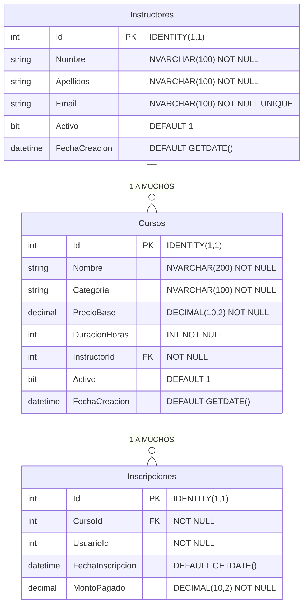

# Diagrama Entidad-Relación de la Base de Datos (PlataformaEducativa)

## Detalles Relevantes
* **Instructores**: Guarda la información básica del instructor.
* **Cursos**: Contiene las métricas necesarias sobre el curso (Precio, Duración, Categoría), y tiene una llave foránea (`InstructorId`). También cuenta con un constraint que impide que un instructor tenga múltiples cursos con el mismo nombre y categoría (`UNIQUE (Nombre, Categoria)`).
* **Inscripciones**: Aunque el CRUD base no requiere endpoints de inscripciones completos, la tabla en la base de datos se relaciona para poder ejecutar los reportes (por ejemplo, contar `MontoPagado` o agrupar inscritos).
